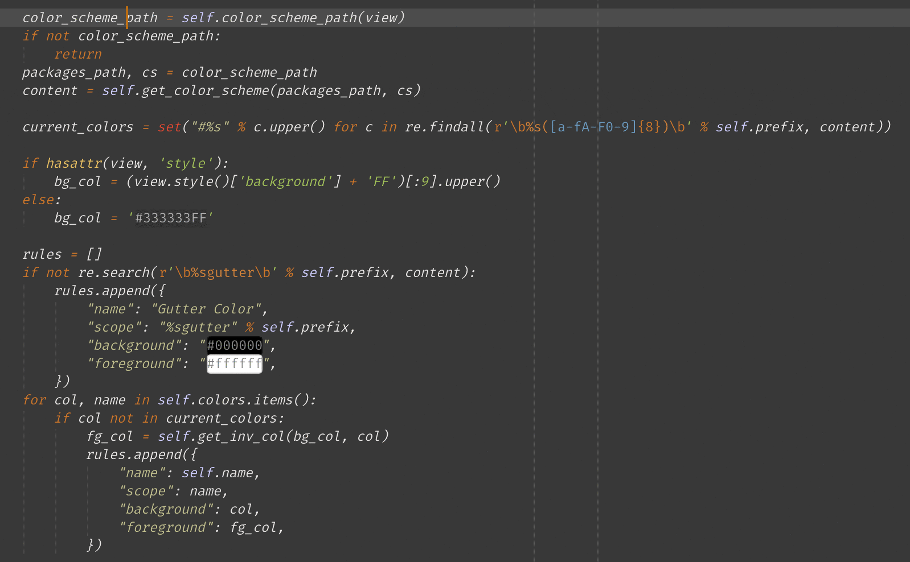

# My Text Marker



My own version of the [Text Marker](https://packagecontrol.io/packages/Text%20Marker) plugin, with bugfixes and adaptations, for Sublime Text.

## Problems & Fixes

- Mnemonics do not match main menu text, triggering warnings when on Windows

    - Fix - remove

- Invalid `path` leads to `IOError` in `read_package()` in [`colorizer.py`](./colorizer.py) when focus is in console

    - Fix - catch and let it pass

- `log.error("Not Updated: Schema format not recognized")` complains whenever the focus is in console

    - Fix - comment that line out

## Install

### Command Palette

```
1. Package Control: Add Repository

    https://github.com/aafulei/sublime-text-marker

2. Package Control: Install Package

    sublime-text-marker
```

### Configuration

- `Default (Windows).sublime-keymap`
- `Default (OSX).sublime-keymap`
- `Default (Linux).sublime-keymap`

```json
[
    { "keys": ["alt+space"], "command": "text_marker" },
    { "keys": ["alt+shift+space"], "command": "text_marker_clear" },
    { "keys": ["primary+alt+shift+space"], "command": "text_marker_reset" },
    { "keys": ["primary+k", "primary+i", "primary+e"], "command": "text_marker_toggle_setting", "args": { "setting": "when_selection_is_empty" } },
    { "keys": ["primary+k", "primary+i", "primary+v"], "command": "text_marker_toggle_setting", "args": { "setting": "live" } }
]
```

- `sublime-text-marker.sublime-settings`

```json
{
    "user":
    {
        "default_colors":
        [
            "darkturquoise",
            "deepskyblue",
            "springgreen",
            "coral",
            "pink",
            "violet",
            "palegoldenrod",
            "gold",
            "orangered",
            "deeppink"
        ],
        "draw_outlined": false,
        "live": true,
        "live_color": "darkturquoise",
        "when_selection_is_empty": false
    }
}
```

## License

Major credits go to the original authors. `Text Marker` is under MIT. All my
fixes and adaptations are under MIT.
